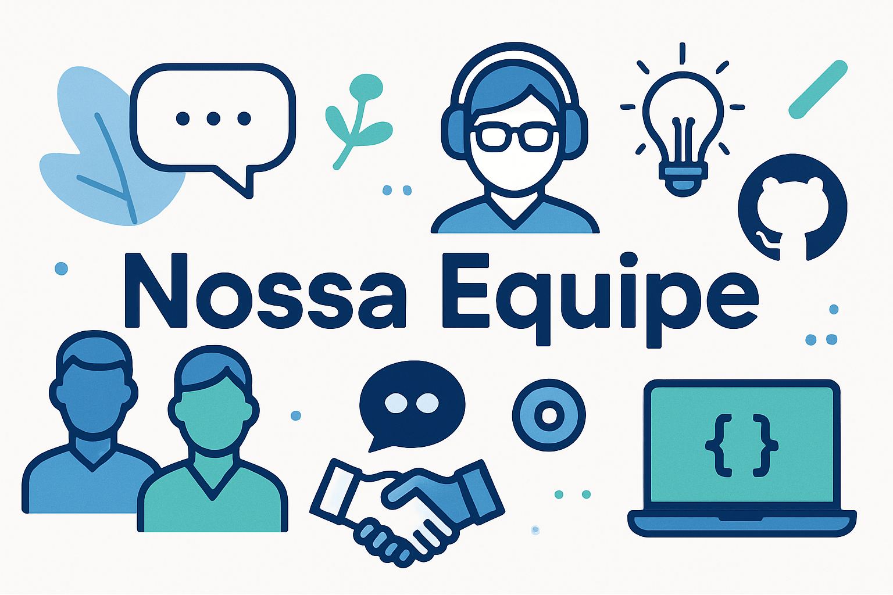

# 👥 Equipe

  

## 🤝 Membros e Funções

Este repositório lista os membros da equipe de desenvolvimento do **Sistema de Abertura de Chamados com IA**, suas respectivas funções e links para contato.

## 📋 Detalhamento da Equipe

| Membro | Função | GitHub | LinkedIn |
| :--- | :--- | :---: | :---: |
| **Maria Luíza Fonseca Amaro** | Product Owner |  |  |
| **Felipe Freitas da Rocha** | Scrum Master |  |  |
| **Ana Beatriz Barni Franco** | Desenvolvedora |  |  |
| **Gabriel Freitas de Campos** | Desenvolvedor |  |  |
| **Maio de Almeida Braga** | Desenvolvedor |  |  |
| **Nicolas Furtado Rodrigues** | Desenvolvedor |  |  |

---

## 🔗 Voltar ao Projeto Principal

[⬅️ Repositório Principal](https://github.com/Nicolasdev29/Proj-Sist-Orientado-A-Objetos-Atividade-boas-praticas-github)

*Este README foi aprimorado para melhor visualização e organização.*
